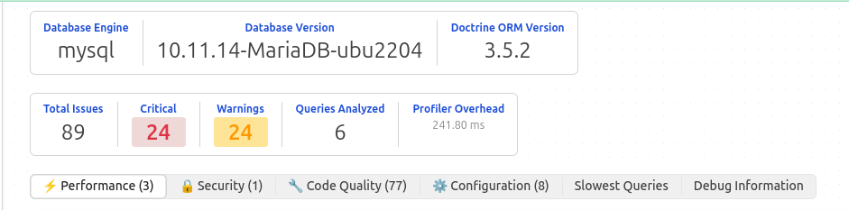

# Analyzer Reference Documentation

## Table of Contents

- [1. Overview](#1-overview)
- [2. Analyzer Taxonomy](#2-analyzer-taxonomy)
- [3. Performance Analyzers](#3-performance-analyzers)
- [4. Security Analyzers](#4-security-analyzers)
- [5. Code Quality Analyzers](#5-code-quality-analyzers)
- [6. Configuration Analyzers](#6-configuration-analyzers)
- [7. Configuration](#7-configuration)
- [8. Extensibility](#8-extensibility)

---

## 1. Overview

Doctrine Doctor implements **66 specialized analyzers** organized into four categories that detect Doctrine ORM anti-patterns and performance issues.

### 1.1 Severity Classification

| Severity | Impact | Examples |
|----------|---------|----------|
| **Critical** | Security vulnerabilities or data loss risk | SQL injection, cascade misconfiguration |
| **High** | Major performance degradation (>50%) | N+1 queries, missing indexes |
| **Medium** | Sub-optimal patterns with measurable impact | Inefficient hydration, architectural issues |
| **Low** | Minor improvements | Naming conventions, code style |

---

## 2. Analyzer Taxonomy

### 2.1 Distribution by Category



### 2.2 Detection Methods

- **Static Analysis**: Entity metadata, configuration analysis
- **Runtime Analysis**: Query pattern recognition, signature matching
- **Database Analysis**: EXPLAIN query execution plans
- **Code Analysis**: Call stack inspection, trace analysis

---

## 3. Performance Analyzers

### 3.1 Category Overview

Performance analyzers detect patterns that degrade application responsiveness, increase database load, or consume excessive system resources.

**Total**: 25 analyzers
**Average Impact**: 10-1000x performance improvement when resolved

### 3.2 Analyzer Catalog

### 3.2 Key Performance Analyzers

#### 3.2.1 NPlusOneAnalyzer

- **Severity**: Critical
- **Purpose**: Detects N+1 query problems (1 initial query + N lazy-loaded queries)
- **Detection**: Query signature matching and execution pattern analysis
- **Impact**: 90-99% query reduction when fixed

#### 3.2.2 MissingIndexAnalyzer

- **Severity**: Critical
- **Purpose**: Identifies queries doing full table scans
- **Detection**: Database EXPLAIN plan analysis
- **Impact**: 10-1000x performance improvement

#### 3.2.3 FlushInLoopAnalyzer

- **Severity**: Critical
- **Purpose**: Finds EntityManager::flush() calls inside loops
- **Detection**: Call stack trace analysis
- **Impact**: 10-100x improvement by batching operations

#### 3.2.4 SlowQueryAnalyzer

- **Severity**: High
- **Purpose**: Flags queries exceeding execution time threshold
- **Detection**: Direct execution time measurement

#### 3.2.5 HydrationAnalyzer

- **Severity**: Medium
- **Purpose**: Detects inefficient result set hydration
- **Impact**: 50-80% memory reduction

---

### 3.3 Performance Analyzer Summary Table

| Analyzer ID | Detection Method | Typical Impact | Configuration |
|-------------|------------------|----------------|---------------|
| NPlusOneAnalyzer | Query signature matching | 90-99% query reduction | `threshold: 3` |
| MissingIndexAnalyzer | EXPLAIN analysis | 10-1000x speedup | `slow_query_threshold: 100` |
| SlowQueryAnalyzer | Execution time | Direct | `threshold: 50` (ms) |
| HydrationAnalyzer | Result set size | 50-80% memory reduction | `row_threshold: 1000` |
| FlushInLoopAnalyzer | Trace analysis | 10-100x | `flush_count_threshold: 3` |
| EagerLoadingAnalyzer | JOIN count | Query optimization | `join_threshold: 5` |
| LazyLoadingAnalyzer | Proxy initialization | Query reduction | `threshold: 10` |
| DTOHydrationAnalyzer | Hydration mode | Memory + performance | — |
| BulkOperationAnalyzer | Entity count | 100-1000x | `threshold: 100` |
| ConnectionPoolingAnalyzer | Connection usage | Scaling | Platform-dependent |
| QueryCachingOpportunityAnalyzer | Cache statistics | 50-90% reduction | — |
| EntityManagerClearAnalyzer | Memory usage | Memory leak prevention | `batch_size_threshold: 100` |
| JoinOptimizationAnalyzer | JOIN complexity | Query simplification | `max_joins: 5` |
| JoinTypeConsistencyAnalyzer | JOIN + WHERE patterns | Semantic clarity | — |
| SetMaxResultsWithCollectionJoinAnalyzer | LIMIT + JOIN | Incorrect results | — |
| PartialObjectAnalyzer | SELECT clause | Memory reduction | `threshold: 5` |
| OrderByWithoutLimitAnalyzer | ORDER BY + full scan | Resource usage | — |
| FindAllAnalyzer | Unfiltered queries | Memory exhaustion | `threshold: 1000` |
| YearFunctionOptimizationAnalyzer | Function in WHERE | Index usage | — |
| IneffectiveLikeAnalyzer | Leading wildcard | Full table scan | — |
| DivisionByZeroAnalyzer | Division operations | Runtime errors | — |
| NullComparisonAnalyzer | NULL handling | Index effectiveness | — |
| CollectionEmptyAccessAnalyzer | Uninitialized collections | Lazy load prevention | — |
| AutoGenerateProxyClassesAnalyzer | Configuration | Production readiness | — |
| DoctrineCacheAnalyzer | Cache configuration | Deprecation warnings | — |

---

## 4. Security Analyzers

### 4.1 Category Overview

Security analyzers detect vulnerabilities aligned with **OWASP Top 10** and Doctrine-specific attack vectors.

**Total**: 4 analyzers
**OWASP Coverage**: A02:2021 (Cryptographic Failures), A03:2021 (Injection), A05:2021 (Security Misconfiguration)

### 4.2 Key Security Analyzers

#### 4.2.1 DQLInjectionAnalyzer

- **Severity**: Critical
- **OWASP**: A03:2021 Injection
- **Purpose**: Detects DQL injection vulnerabilities in string concatenation
- **Detection**: AST analysis of DQL string construction

#### 4.2.2 SQLInjectionInRawQueriesAnalyzer

- **Severity**: Critical
- **OWASP**: A03:2021 Injection
- **Purpose**: Finds SQL injection in native queries
- **Detection**: Native query pattern analysis

#### 4.2.3 SensitiveDataExposureAnalyzer

- **Severity**: Critical
- **OWASP**: A02:2021 Cryptographic Failures
- **Purpose**: Detects sensitive fields exposed in serialization
- **Detection**: Field pattern matching (password, token, secret, api_key)

#### 4.2.4 InsecureRandomAnalyzer

- **Severity**: Medium
- **Purpose**: Identifies insecure random number generation
- **Detection**: Usage of `rand()` in security contexts

---

## 5. Code Quality Analyzers

### 5.1 Category Overview

Code Quality analyzers detect code smells, anti-patterns, and violations of best practices that affect maintainability, readability, and adherence to Doctrine ORM conventions.

**Total**: 29 analyzers
**Focus**: Type safety, relationship consistency, lifecycle management, naming conventions

### 5.2 Key Analyzers

#### 5.2.1 CascadeConfigurationAnalyzer

**Description**: Validates consistency between ORM cascade operations and database foreign key constraints.

**Violation Example**:

```php
/**
 * @ORM\OneToMany(targetEntity="Item", mappedBy="order", cascade={"remove"})
 */
private Collection $items;

// Database: ON DELETE SET NULL (mismatch!)
```

**Issue**: ORM expects cascade delete, database sets NULL → inconsistent state

---

#### 5.2.2 BidirectionalConsistencyAnalyzer

**Description**: Ensures symmetric mapping in bidirectional relationships.

**Violation**:

```php
class Order {
    /** @ORM\ManyToOne(targetEntity="Customer", inversedBy="orders") */
    private Customer $customer;
}

class Customer {
    /** @ORM\OneToMany(targetEntity="Order", mappedBy="wrongField") */
    //                                               ↑ Should be "customer"
    private Collection $orders;
}
```

---

### 5.3 Code Quality Analyzer Summary

| Analyzer | Focus Area | Violation Type | Impact |
|----------|------------|----------------|--------|
| BidirectionalConsistencyAnalyzer | Relationship symmetry | Mapping error | ORM malfunction |
| CascadeConfigurationAnalyzer | Aggregate consistency | ORM/DB mismatch | Data corruption |
| CascadeAllAnalyzer | Explicit design | Over-automation | Unintended side effects |
| CascadePersistOnIndependentEntityAnalyzer | Aggregate boundaries | Wrong cascade scope | Data integrity |
| CascadeRemoveOnIndependentEntityAnalyzer | Entity independence | Improper deletion | Data loss |
| OrphanRemovalWithoutCascadeRemoveAnalyzer | Lifecycle management | Configuration inconsistency | Memory leak |
| MissingOrphanRemovalOnCompositionAnalyzer | Composition pattern | Missing cleanup | Orphaned records |
| OnDeleteCascadeMismatchAnalyzer | Layer consistency | ORM vs DB conflict | Undefined behavior |
| ForeignKeyMappingAnalyzer | Referential integrity | Primitive FK exposure | Architecture violation |
| TransactionBoundaryAnalyzer | ACID compliance | Transaction scope | Data inconsistency |
| EntityStateConsistencyAnalyzer | UnitOfWork pattern | State management | Sync issues |
| FinalEntityAnalyzer | Proxy compatibility | Non-final entities | Proxy failures |
| EmbeddableMutabilityAnalyzer | Value object | Mutable embeddables | Side effects |
| EmbeddableWithoutValueObjectAnalyzer | Value object pattern | Missing VO semantics | Design smell |
| MissingEmbeddableOpportunityAnalyzer | Cohesion | Scattered value objects | Maintainability |
| DecimalPrecisionAnalyzer | Type system | Precision loss | Financial errors |
| FloatForMoneyAnalyzer | Type system | Floating-point rounding | Calculation errors |
| FloatInMoneyEmbeddableAnalyzer | Value objects | Incorrect money handling | Financial bugs |
| PropertyTypeMismatchAnalyzer | Type safety | PHP↔DB type mismatch | Runtime errors |
| ColumnTypeAnalyzer | Column definitions | Wrong type usage | Data loss |
| CollectionInitializationAnalyzer | Object lifecycle | Uninitialized collections | Null pointer exceptions |
| GetReferenceAnalyzer | Performance | Unnecessary queries | Database overhead |
| PrimaryKeyStrategyAnalyzer | ID generation | Inefficient strategy | Performance issues |
| QueryBuilderBestPracticesAnalyzer | Code quality | Bad QueryBuilder patterns | Maintainability |
| EntityManagerInEntityAnalyzer | Architecture | Dependency injection | Architecture violation |
| TypeHintMismatchAnalyzer | Type safety | Type inconsistency | Runtime errors |
| NamingConventionAnalyzer | Code standards | Naming violations | Readability issues |

---

## 6. Configuration Analyzers

### 6.1 Key Configuration Analyzers

#### 6.1.1 TimeZoneAnalyzer

- **Purpose**: Detects timezone handling issues in datetime fields
- **Recommendation**: Use DateTimeImmutable with UTC timezone

#### 6.1.2 Gedmo Extension Analyzers

- **TimestampableTraitAnalyzer**: Validates timestampable trait configuration
- **BlameableTraitAnalyzer**: Ensures proper user tracking setup
- **SoftDeleteableTraitAnalyzer**: Validates soft delete configuration

#### 6.1.3 Database Configuration

- **CharsetAnalyzer**: Detects charset issues (recommends UTF8MB4)
- **CollationAnalyzer**: Validates collation settings for proper sorting
- **StrictModeAnalyzer**: Ensures MySQL strict mode is enabled
- **InnoDBEngineAnalyzer**: Validates InnoDB storage engine usage

### 6.2 Configuration Summary

| Focus Area | Analyzers | Key Recommendations |
|------------|-----------|---------------------|
| Timezone | TimeZoneAnalyzer | Use UTC + DateTimeImmutable |
| Gedmo Traits | 3 analyzers | Proper trait configuration |
| Database Setup | 4 analyzers | UTF8MB4 charset + strict mode + InnoDB |

---

## 7. Configuration

### 7.1 Basic Configuration

```yaml
doctrine_doctor:
    enabled: true
    profiler:
        show_in_toolbar: true
        show_debug_info: false
```

### 7.2 Analyzer Configuration

```yaml
doctrine_doctor:
    analyzers:
        n_plus_one:
            enabled: true
            threshold: 3
        slow_query:
            enabled: true
            threshold: 50  # milliseconds
        missing_index:
            enabled: true
            slow_query_threshold: 100
```

### 7.3 Category Configuration

```yaml
doctrine_doctor:
    groups:
        performance: true
        security: true
        code_quality: true
        configuration: true
```

## 8. Extensibility

### 8.1 Custom Analyzers

Create custom analyzers by implementing `AnalyzerInterface`:

```php
use AhmedBhs\DoctrineDoctor\Analyzer\AnalyzerInterface;

final class CustomAnalyzer implements AnalyzerInterface
{
    public function analyze(QueryDataCollection $queries): iterable
    {
        // Custom detection logic
    }
}
```

### 8.2 Registration

```yaml
services:
    App\Analyzer\CustomAnalyzer:
        tags:
            - { name: 'doctrine_doctor.analyzer' }
```

---

**[← Back to Main Documentation](../README.md)** | **[Configuration →](CONFIGURATION.md)**
