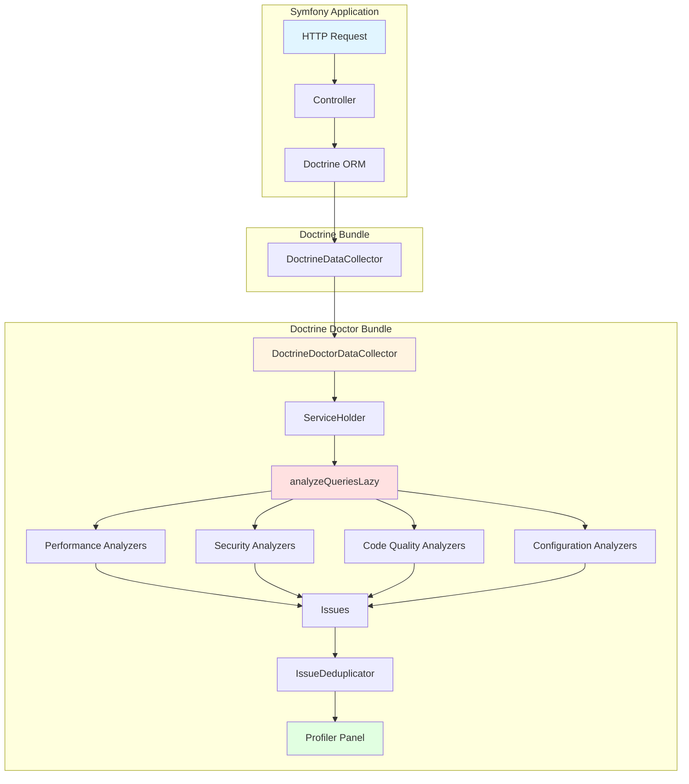
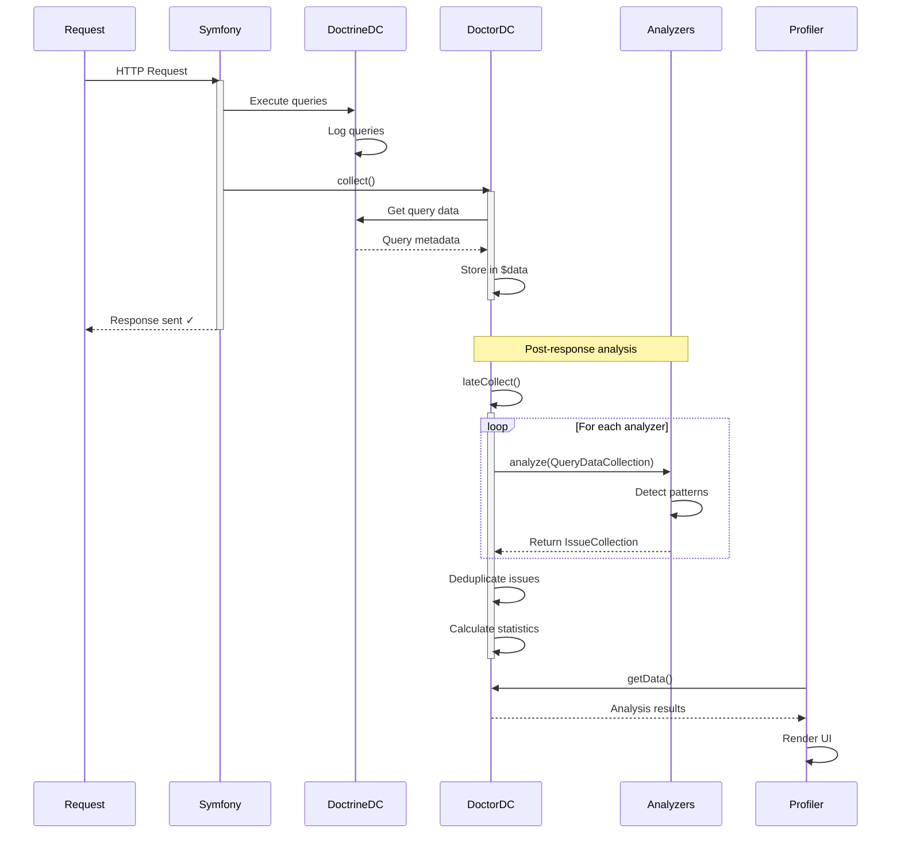

# System Architecture

## Table of Contents

- [1. Overview](#1-overview)
- [2. Architectural Patterns](#2-architectural-patterns)
- [3. Component Diagram](#3-component-diagram)
- [4. Analysis Lifecycle Diagram](#4-analysis-lifecycle-diagram)
- [5. Class Structure](#5-class-structure)
- [6. Design Decisions](#6-design-decisions)
- [7. Extension Points](#7-extension-points)

---

## 1. Overview

Doctrine Doctor follows a **layered architecture** pattern with clear separation of concerns:

```text
┌──────────────────────────────────────────────┐
│           Presentation Layer                 │
│   (Symfony Web Profiler Integration)        │
└────────────────────┬─────────────────────────┘
                     │
┌────────────────────▼─────────────────────────┐
│          Application Layer                   │
│  (Data Collectors, Issue Reconstructors)     │
└────────────────────┬─────────────────────────┘
                     │
┌────────────────────▼─────────────────────────┐
│           Domain Layer                       │
│   (Analyzers, Issues, Suggestions)           │
└────────────────────┬─────────────────────────┘
                     │
┌────────────────────▼─────────────────────────┐
│       Infrastructure Layer                   │
│  (Doctrine ORM, Database, Templates)         │
└──────────────────────────────────────────────┘
```

### 1.1 Layer Responsibilities

#### Presentation Layer

- Symfony Profiler panel rendering
- Twig template integration
- Visual representation of analysis results

#### Application Layer

- Query data collection
- Analysis coordination
- Issue aggregation and deduplication
- Service orchestration

#### Domain Layer

- Core analysis algorithms
- Business logic for issue detection
- Suggestion generation
- Domain models (Issue, Suggestion, QueryData)

#### Infrastructure Layer

- Doctrine ORM integration
- Database platform abstraction
- PHP template rendering system
- External service integrations

---

## 2. Architectural Patterns

### 2.1 Strategy Pattern (Analyzers)

Each analyzer implements the `AnalyzerInterface`, enabling runtime composition. This pattern provides:

- **Open/Closed Principle compliance** - Add new analyzers without modifying existing code
- **Easy addition of new analyzers** - Simply implement the interface and tag the service
- **Independent testing** - Each analyzer can be tested in isolation
- **Dynamic analyzer selection** - Enable/disable analyzers via configuration

### 2.2 Template Method Pattern (Analysis Pipeline)

The analysis process follows a defined template implemented by Symfony's `DataCollector` and `LateDataCollectorInterface`:

1. **collect()** - Capture raw query data (fast, ~1-2ms, runs during request)
2. **lateCollect()** - Perform heavy analysis (10-50ms, runs AFTER response sent)
3. **serialize()** - Prepare analysis results for storage/display
4. **unserialize()** - Restore analysis results from cache

This pattern ensures analysis overhead doesn't impact request time metrics.

### 2.3 Issue Creation Pattern

Each analyzer creates `Issue` objects with:

- **Severity** (Critical, High, Medium, Low)
- **Category** (Performance, Security, Code Quality, Configuration)
- **Suggestion** (with code examples and descriptions)
- **Location** (backtrace, query context)
- **Metadata** (queries, execution time, affected entities)

### 2.4 Dependency Inversion Principle

High-level modules depend on abstractions, not concrete implementations:

- **Analyzers** depend on `TemplateRendererInterface`, not specific renderers
- **DoctrineDoctorDataCollector** depends on `AnalyzerInterface[]`, not concrete analyzers
- **Template rendering** uses `TemplateRendererInterface` (implemented by `PhpTemplateRenderer` or `TwigTemplateRenderer`)

This allows easy substitution of implementations without changing high-level code.

---

## 3. Component Diagram



---

## 4. Analysis Lifecycle Diagram



---

## 5. Class Structure

### 5.1 Core Interfaces

```php
/**
 * Analyzer Interface - Strategy Pattern
 */
interface AnalyzerInterface
{
    /**
     * Analyze queries and return issues.
     *
     * @param QueryDataCollection $queryDataCollection Collected query data
     * @return IssueCollection Collection of detected issues
     */
    public function analyze(QueryDataCollection $queryDataCollection): IssueCollection;
}

/**
 * Template Renderer Interface - Dependency Inversion
 */
interface TemplateRendererInterface
{
    /**
     * Render a template with given context.
     *
     * @param string $templateName Name/identifier of the template
     * @param array<string, mixed> $context Variables to pass to the template
     * @throws \RuntimeException If template not found or rendering fails
     * @return array{code: string, description: string} Rendered code and description
     */
    public function render(string $templateName, array $context): array;

    /**
     * Check if a template exists.
     */
    public function exists(string $templateName): bool;
}

/**
 * Issue Interface - Domain Model
 */
interface IssueInterface
{
    public function getType(): string;
    public function getTitle(): string;
    public function getDescription(): string;
    public function getSeverity(): Severity;
    public function getCategory(): string;
    public function getSuggestion(): ?SuggestionInterface;
    public function getBacktrace(): ?array;
    public function getQueries(): array;
    public function getData(): array;
    public function toArray(): array;
}
```

### 5.2 Class Diagram

```text
┌─────────────────────────────────┐
│   DoctrineDoctorDataCollector   │
│   extends DataCollector          │
│   implements LateDataCollector   │
├─────────────────────────────────┤
│ - analyzers: AnalyzerInterface[]│
│ - helpers: DataCollectorHelpers  │
│ - doctrineCollector              │
├─────────────────────────────────┤
│ + collect(Request, Response)     │
│ + lateCollect()                  │
│ + getData(): array               │
│ + getName(): string              │
└────────────┬────────────────────┘
             │ uses
             ▼
┌─────────────────────────────────┐
│      DataCollectorHelpers       │
├─────────────────────────────────┤
│ - databaseInfoCollector          │
│ - issueReconstructor             │
│ - queryStatsCalculator           │
│ - dataCollectorLogger            │
│ - issueDeduplicator              │
└────────────┬────────────────────┘
             │ coordinates
             ▼
┌─────────────────────────────────┐
│      AnalyzerInterface          │◄──────────┐
├─────────────────────────────────┤           │
│ + analyze(QueryDataCollection)  │           │
│   : IssueCollection              │           │
└─────────────────────────────────┘           │
             △                                 │
             │ implements                      │
     ┌───────┴────────┬───────────────┐       │
     │                │               │       │
┌────────┐    ┌──────────────┐  ┌────────┐   │
│N+1     │    │SlowQuery     │  │Security│   │
│Analyzer│    │Analyzer      │  │Analyzer│   │
└────────┘    └──────────────┘  └────────┘   │
                                              │
                                        uses  │
┌─────────────────────────────────┐           │
│     TemplateRendererInterface   │───────────┘
├─────────────────────────────────┤
│ + render(name, ctx): array      │
│ + exists(name): bool            │
└─────────────────────────────────┘
             △
             │ implements
     ┌───────┴────────┐
     │                │
┌────────────┐  ┌──────────────┐
│PhpTemplate │  │TwigTemplate  │
│Renderer    │  │Renderer      │
└────────────┘  └──────────────┘
```

---

## 6. Design Decisions

### 6.1 Late Data Collection

**Decision**: Implement `LateDataCollectorInterface` for analysis execution.

**Rationale**:

- Analysis overhead not included in request time metrics
- Heavy operations (EXPLAIN queries, entity metadata inspection) deferred
- User experience unaffected by analysis time
- Profiler data still available post-response

**Trade-offs**:

- Additional complexity in service lifecycle management
- ServiceHolder pattern required for post-response DI access
- Cannot modify response based on analysis (acceptable for dev tool)

### 6.2 PHP Template System

**Decision**: Use native PHP templates instead of solely Twig.

**Rationale**:

- **Flexibility**: Full PHP capabilities for complex code generation
- **No Twig Dependency**: Core functionality works without Twig
- **Performance**: No template compilation overhead
- **Familiarity**: Standard PHP syntax for contributors

**Implementation**:

````php
// Template: left_join_with_not_null.php
<?php ob_start(); ?>
## Issue: LEFT JOIN with IS NOT NULL

Your query uses LEFT JOIN but filters with IS NOT NULL:
```sql
<?= $context->original_query ?>
```

This is contradictory. Use INNER JOIN instead.
<?php
$code = ob_get_clean();
return ['code' => $code, 'description' => 'Suggestion'];
````

**Note**: Templates use `SafeContext` for automatic XSS protection. See [Template Security Guide](TEMPLATE_SECURITY.md) for details.

### 6.3 Analyzer Independence

**Decision**: Each analyzer is stateless and independent.

**Rationale**:

- Parallel execution potential (future optimization)
- Independent testing and development
- Configurable enable/disable per analyzer
- No inter-analyzer dependencies

**Implementation**:

- Constructor injection of dependencies only
- No shared mutable state
- Returns `IssueCollection` for type safety and predictability

### 6.4 Severity Classification

**Decision**: Four-level severity system (Critical, High, Medium, Low).

**Rationale**:

- Aligned with industry standards (CVSS, issue tracking systems)
- Clear priority communication
- Filterable in UI
- Objective criteria per analyzer

**Criteria**:

- **Critical**: Security vulnerability, data loss risk, production failure
- **High**: Significant performance degradation, architectural violation
- **Medium**: Sub-optimal patterns, improvement opportunities
- **Low**: Style, cosmetic issues

---

## 7. Extension Points

### 7.1 Custom Analyzer Registration

```yaml
# config/services.yaml
services:
    App\Analyzer\CustomBusinessRuleAnalyzer:
        arguments:
            $threshold: 100
        tags:
            - { name: 'doctrine_doctor.analyzer' }
```

### 7.2 Custom Template Renderer

```php
namespace App\Infrastructure;

use AhmedBhs\DoctrineDoctor\Template\Renderer\TemplateRendererInterface;

class CustomTemplateRenderer implements TemplateRendererInterface
{
    public function render(string $templateName, array $context): array
    {
        // Custom rendering logic (e.g., Markdown, reStructuredText)
    }
}
```

```yaml
services:
    App\Infrastructure\CustomTemplateRenderer: ~

    AhmedBhs\DoctrineDoctor\Template\Renderer\TemplateRendererInterface:
        alias: App\Infrastructure\CustomTemplateRenderer
```

### 7.3 Custom Issue Handling

Extend `DataCollectorHelpers` for custom issue processing:

```php
namespace App\Service;

use AhmedBhs\DoctrineDoctor\Collector\DataCollectorHelpers;

class CustomDataCollectorHelpers extends DataCollectorHelpers
{
    public function processIssues(array $issues): array
    {
        // Custom filtering, prioritization, or enrichment
        return array_filter($issues, fn($issue) =>
            $this->matchesBusinessRules($issue)
        );
    }
}
```

---

## References

- [Symfony DataCollector Documentation](https://symfony.com/doc/current/profiler/data_collector.html)
- [Doctrine ORM Architecture](https://www.doctrine-project.org/projects/doctrine-orm/en/latest/reference/architecture.html)
- [Clean Architecture Principles](https://blog.cleancoder.com/uncle-bob/2012/08/13/the-clean-architecture.html)
- [Design Patterns: Elements of Reusable Object-Oriented Software](https://en.wikipedia.org/wiki/Design_Patterns)

---

**[← Back to Main Documentation](../README.md)** | **[Configuration Reference →](CONFIGURATION.md)**
